# Архитектура поиска и ранжирования

Проект разделяет источники данных, enrichment, discovery, scoring и генерацию
офферов. Provider-интерфейсы позволяют проверять бизнес-логику офлайн и позже
заменять mock-источники внешними API без изменения scoring-ядра.

## Схема автоматизации

```mermaid
flowchart LR
    GS["Google Sheets<br/>реально проверено<br/>public CSV export"]
    SL["Source Loader<br/>реально проверено"]
    IE["Instagram Enrichment Provider<br/>Apify: реально проверено<br/>mock: demo"]
    IPA["Ideal Profile Analyzer<br/>mock + dry-run<br/>Responses API: реализован"]
    SP["Search Provider<br/>mock: demo<br/>Tavily: требует API key"]
    CE["Candidate Enricher<br/>mock/demo"]
    SE["Scoring Engine<br/>mock/demo<br/>0–100 + MIN_SCORE"]
    OG["Offer Generator<br/>mock/demo<br/>LLM: требует API key"]
    HR["Human Review<br/>обязательный этап"]
    OUT["CSV / Google Sheets<br/>CSV: demo<br/>обратная запись: вне MVP"]

    GS --> SL --> IE --> IPA --> SP --> CE --> SE --> OG --> HR --> OUT
```



Схема показывает целевой последовательный процесс. В текущей офлайн-команде
`python -m src.main` нормализованные mock-эталоны сразу поступают в
`Ideal Profile Analyzer`, а `Search Provider` читает mock-кандидатов из CSV.
Реальное Apify enrichment проверено отдельно. LLM-анализ запускается отдельной
командой из сохранённого enrichment-файла; OpenAI dry-run проверен, но платный
OpenAI/Tavily end-to-end запуск не выполнялся.

## Границы модулей

- `sheets_loader.py` читает строгие mock-CSV и неизвестную структуру публичного
  Google-листа, сопоставляет синонимы колонок и формирует безопасный inspection.
- `profile_enrichment_providers.py` реализует mock/Apify provider, нормализацию
  Instagram URL, ER, 24-часовой cache и audit. Токен передаётся только в Bearer
  header и не сохраняется.
- `profile_analyzer.py` строит прежний `IdealBloggerProfile` детерминированно для
  scoring-пайплайна.
- `llm_profile_analyzer.py` фильтрует реальный enrichment, применяет allow-list,
  batching, mock/OpenAI Responses API, Pydantic Structured Outputs, retry,
  промежуточное сохранение и отдельный audit.
- `search_providers.py` скрывает discovery-источник. `MockSearchProvider`
  работает без сети; `TavilySearchProvider` использует публичную поисковую
  выдачу и требует персональный ключ.
- `candidate_enricher.py` нормализует Instagram, YouTube и Telegram URL,
  удаляет дубли и магазины, оставляет неизвестные признаки равными `null`.
- `candidate_ranker.py` рассчитывает девять критериев, применяет `MIN_SCORE` и
  `TOP_K`, не завися от provider-а поиска.
- `offer_generator.py` создаёт объяснимые mock-черновики. Любой оффер перед
  использованием проходит ручную проверку.

## Потоки и артефакты

```text
mock source CSV -> IdealBloggerProfile
                -> search queries -> data/search_queries.json
                -> SearchProvider -> Candidate Enricher
                -> deterministic scoring -> MIN_SCORE -> TOP_K
                -> draft offers -> human review -> data/results.csv
                `-> all discovery decisions -> data/search_audit.csv
```

Отдельный диагностический контур:

```text
public Google Sheet -> read-only CSV export -> RawSourceBlogger inspection
                    -> Apify/mock enrichment -> cache + summary + audit
                    -> LLM batches -> source portrait + LLM audit
```

## Audit trail и human-in-the-loop

Каждый discovery URL получает одно решение в `search_audit.csv`. После scoring
`accepted` заменяется на `below_min_score`, если профиль не прошёл порог.
Enrichment-аудит отдельно фиксирует `success`, `partial`, `failed`, невалидные
и повторные ссылки.

Автоматический результат — shortlist, а не разрешение на коммуникацию. До
отправки сотрудник LD LATTE проверяет публичный профиль, соответствие женской
одежде и аудитории Wildberries/Ozon, brand safety, метрики, рекламную нагрузку,
условия бартера и окончательную формулировку оффера.

## Безопасность и достоверность

- Instagram cookies, логины, пароли и браузерная автоматизация не используются.
- Публичные title/snippet и данные Actor могут быть неполными или устаревшими.
- Неизвестные факты остаются `null`, а не выдумываются.
- `.env`, cache, сырые ответы и реальные enrichment-выгрузки исключены из Git.
- Google Sheets подключён только на чтение; обратная запись находится вне MVP.
